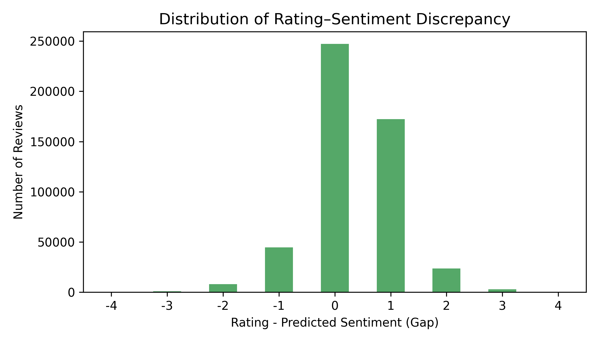

# Sentiment–Rating Misalignment in Amazon Reviews

How often does a reviewer's text disagree with the stars they give? This
project measures that gap across **1,494,121 Amazon reviews**, identifies what
predicts it, and tests whether it moves product reputation.

**Lixing Yang** — project lead, 4-person team
CISC 351 Advanced Data Analytics, Queen's University

---

## Why it matters

E-commerce platforms treat the star rating and the review text as two
expressions of a single opinion. Recommendation engines, seller rankings and
"verified purchase" trust signals all rest on that assumption. It does not hold
reliably — reviewers describe a late delivery, a poor fit or a broken part, and
then award five stars anyway.

That gap is measurable. This project quantifies it at scale and asks what
drives it.

## Approach

Every review carries two independent signals on the same 1–5 scale: the star
rating the reviewer clicked, and a BERT reading of what they wrote. The
difference between them is the unit of analysis throughout:

```
rating_gap = rating − predict_stars
```

| | Question | Method |
|---|---|---|
| **RQ1** | How far apart are a review's emotional intensity and its star rating? | Sentence-level BERT sentiment → `rating_gap` → LDA / BERTopic / TF-IDF |
| **RQ2** | Which review characteristics predict the mismatch? | TF-IDF → K-Means (k=5) → length × verification breakdown |
| **RQ3** | Do misaligned reviews move reputation and sales? | VADER → product-level aggregation → Random Forest |

Reviews split into three groups by the sign of the gap: **A** — stars above the
text's sentiment, **B** — stars below it, **C** — aligned.

## Results

Produced by `src/corpus_stats.py` over the full corpus; the raw output is
checked in at [`results/corpus_stats.json`](results/corpus_stats.json).

| | |
|---|---|
| Reviews analysed | 1,494,121 |
| Categories | Electronics · Clothing, Shoes & Jewelry · Health & Personal Care |
| Severely misaligned (`\|gap\| ≥ 2`) | **7.22%** |
| Mean `rating_gap` | **+0.32** stars |

**The central finding is an asymmetry.** Half of all reviews carry a gap at
all, and when stars and text disagree, the stars are the more generous signal
in **77.8%** of cases:

| Group | Share | |
|---|---|---|
| **A** — stars above text | **39.54%** | 590,785 |
| **C** — aligned | 49.16% | 734,560 |
| **B** — stars below text | **11.30%** | 168,776 |

A 3.5:1 positivity bias, consistent across all three categories. Reviewers
systematically round up.

**Verification status does not predict misalignment.** The intuition that
unverified purchases drive rating inflation does not hold at corpus scale:

| | Severe misalignment | n |
|---|---|---|
| Verified purchase | 7.19% | 1,286,994 |
| Unverified | 7.38% | 207,127 |
| Difference | **0.19pp** | |

**What does predict it is review length.** Clustering the Clothing category
(483,948 reviews, k=5) and breaking the widest-gap cluster down by length and
verification status — `python src/rq2_topics.py` — puts long reviews on top in
both verification states:

| Group | Misaligned | n |
|---|---|---|
| Long + Verified | **6.94%** | 3,921 |
| Long + Unverified | 5.66% | 5,353 |
| Short + Verified | 3.85% | 30,499 |
| Short + Unverified | 2.28% | 2,982 |

Length roughly doubles the misalignment rate; verification moves it by about a
point in the same direction for both. A reviewer who writes at length has room
to voice reservations the star rating never registers.

**Per category:**

| Category | Reviews | Misaligned | Mean gap |
|---|---|---|---|
| Electronics | 500,000 | 7.16% | +0.33 |
| Clothing, Shoes & Jewelry | 500,000 | 6.22% | +0.36 |
| Health & Personal Care | 494,121 | 8.29% | +0.27 |



**At product level, the star average is near-uninformative.** Aggregating to
38,272 products with five or more reviews and fitting random forests
(`python src/rq3_reputation.py`):

| Feature | → Sales proxy | → Reputation risk |
|---|---|---|
| Verified-purchase share | **0.572** | 0.007 |
| Helpful votes | 0.132 | 0.011 |
| Mean rating | 0.104 | **0.018** |
| Mean sentiment | 0.066 | 0.922 |
| Review length | 0.064 | 0.026 |
| Time weight | 0.063 | 0.016 |

A product's mean star rating contributes 0.018 toward explaining the sentiment
its own reviews carry. Mean sentiment feeds the risk index by construction, so
that model's R² (0.924) measures internal consistency rather than predictive
skill — the finding is the negative space around it. The sales model
(R² = 0.710) has no such circularity, and verified-purchase share dominates it:
verification says a lot about a *product* and almost nothing about whether an
individual *review* is misaligned.

## Repository layout

```
src/
  config.py            paths and shared constants; one overridable data root
  corpus_stats.py      corpus-wide statistics — stdlib only, streams, no pandas
  rq2_topics.py        TF-IDF + K-Means clustering and cluster profiling
  rq3_reputation.py    product-level reputation risk and random forests
  lib/
    text.py            VADER-safe and bag-of-words cleaners
    metrics.py         reputation risk index and sales proxy
tests/                 17 unit tests; no data or third-party packages needed
report/                project report (8pp, IEEE format) and 26-slide presentation
figures/               all report figures
results/               pipeline output, checked in
data/README.md         how to obtain and score the corpus
```

## Running it

```bash
pip install -r requirements.txt
python -m unittest discover -s tests -v     # no data required
```

With the corpus in place (see [data/README.md](data/README.md)):

```bash
python src/corpus_stats.py                                  # tables above
python src/rq2_topics.py --category Clothing_Shoes_and_Jewelry
python src/rq3_reputation.py
```

`REVIEW_DATA_DIR` overrides the data location:

```bash
REVIEW_DATA_DIR=~/datasets/amazon python src/corpus_stats.py
```

## Data

The corpus is not committed — the scored CSVs total roughly 600 MB, past
GitHub's file limits. [data/README.md](data/README.md) documents the source
([Amazon Reviews 2023](https://amazon-reviews-2023.github.io/)), the exact
schema, and how `predict_stars` is generated.

## Notes on method

- **`predict_stars` is a model output, not a label.** Its accuracy on this
  corpus is unmeasured, and a general-purpose sentiment classifier is routinely
  a star out. `|gap| ≥ 2` is a screening threshold for cases worth examining,
  not evidence a review is dishonest. Establishing that split needs a
  hand-labelled sample.
- **Sentiment scoring and bag-of-words modelling get different text.** VADER
  reads intensity from punctuation runs, capitalisation and emoji, so those are
  preserved for it and stripped only for TF-IDF, LDA and K-Means.
- **The two RQ3 targets share an input.** `sales_proxy` is log review count, and
  review volume also feeds the reputation index's exposure term. Measured
  correlation is +0.159 — low enough that they behave largely independently, but
  the pipeline reports it rather than assuming it.
- **The reputation model is partly circular.** Mean sentiment is an input to the
  risk index, so its R² reflects the forest recovering that definition. The
  feature *ranking* is the result; the R² is not.
- **Cluster ids are unstable.** K-Means numbers clusters arbitrarily, so RQ2
  selects its cluster of interest by widest mean gap rather than by index.

## Stack

Python · pandas · scikit-learn · PyTorch · Transformers (BERT) · VADER ·
BERTopic · LDA · Random Forest · K-Means · TF-IDF · matplotlib / seaborn ·
Jupyter · LaTeX

## Credits

A four-person course project. I led the team, owned RQ2 end to end and wrote the
study's conclusions; RQ1 and RQ3 were built by teammates. The report and slides
in `report/` carry the full author list.

## Licence

Code MIT — see [LICENSE](LICENSE). The report and slides are coursework,
included for reference. The Amazon Reviews 2023 dataset is governed by its own
terms.
